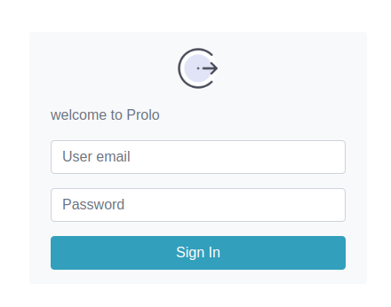

**how to install**
> Kindly keep in mind that this login page is desigen to occupy the all page.
* download the file login001.html to snips folder of your project.
* download all icons to icons folder of your project and you are ready to go.
* To implement the code in your project you simple need to add the snipest you just downloaded to a container. There are various methods to do it, which all explain in the doc. But for a beginer, just add the folowing code to your project.
```php  
    $code=new Section();
    $code->addItem($page->snip("login001"));
    $code->data("action","x.php");//the page you want to submit the form
    $code->data("method","POST");//the method to submit the form
    $code->getIcons();
    $code->show();
```

